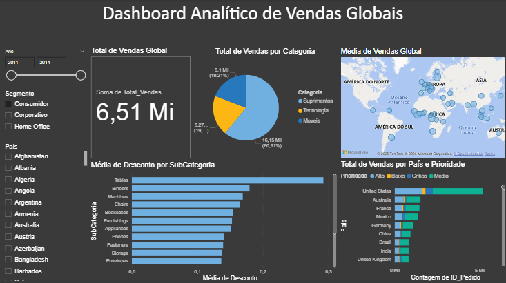

# Dashboard de Análise de Vendas (Power BI)

Este repositório contém um dashboard interativo desenvolvido em Power BI, com o objetivo de fornecer insights estratégicos sobre as vendas de uma empresa, permitindo uma análise detalhada e a tomada de decisões mais informadas.

---

## 📊 Objetivo do Projeto

O principal objetivo deste dashboard é responder a perguntas de negócios cruciais, transformando dados brutos em informações claras e acionáveis. Especificamente, o dashboard foi projetado para responder às seguintes questões:

1.  **Valor Total Vendido:** Qual o montante total de vendas realizadas?
2.  **Vendas por Categoria de Produto:** Como as vendas se distribuem entre as diferentes categorias de produtos?
3.  **Vendas por País e Prioridade de Entrega:** Quantas vendas foram realizadas por país, considerando a prioridade de entrega (baixa, média, alta, crítica)?
4.  **Média de Desconto por Subcategoria de Produto:** Qual foi o desconto médio aplicado nas vendas para cada subcategoria de produto?
5.  **Média de Valor de Venda por País:** Quais países registraram a maior média de valor por venda?

---

## ⚙️ Funcionalidades Interativas

Para proporcionar uma exploração flexível dos dados, o dashboard permite que o usuário filtre as informações por:

* **Ano:** Analise o desempenho das vendas em diferentes períodos anuais.
* **Segmento:** Compare as vendas entre os diversos segmentos de mercado (por exemplo, Consumidor, Corporativo, Home Office).
* **País:** Foque a análise em regiões geográficas específicas.

---

## 📈 Insights Gerados

Este dashboard permite aos usuários identificar rapidamente:

* As categorias de produtos com melhor desempenho.
* Padrões de vendas em diferentes países e a influência da prioridade de entrega.
* A eficácia das estratégias de desconto por subcategoria.
* Os mercados geográficos com maior valor médio por transação.

---

## 🛠️ Tecnologias Utilizadas

* **Power BI Desktop:** Ferramenta principal utilizada para conexão de dados, transformação (Power Query), modelagem e criação das visualizações interativas.

---

## 📚 Fonte dos Dados

Os dados utilizados para este projeto foram obtidos através da plataforma **Datascience Academy**, como parte do curso de Business Intelligence com Power BI.

---

## 🚀 Como Visualizar o Projeto

Para explorar o dashboard, faça o download do arquivo `.pbix` presente neste repositório e abra-o com o Power BI Desktop.

---

**Autor:** Datascience Academy
**Aluno:** Gustavo Alves/@Gustsilv
